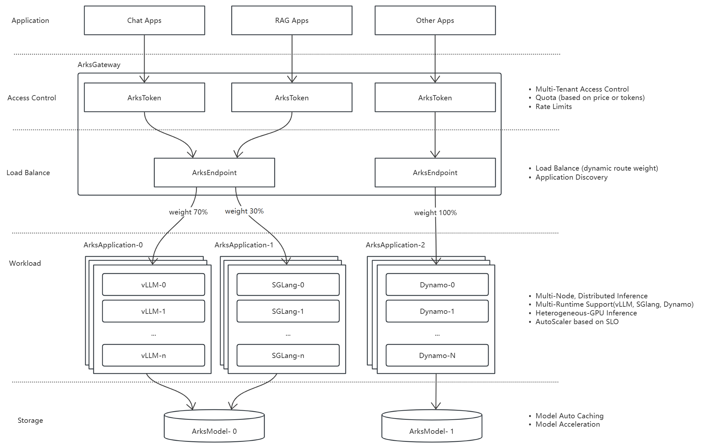

# Arks

## Overview
*Arks* is an end-to-end framework for managing LLM-based applications within Kubernetes clusters. It provides a robust and extensible infrastructure tailored for deploying, orchestrating, and scaling LLM inference workloads in cloud-native environments.

## Key Features

### Distributed Inference
- *Multi-node scheduling*: Run inference across multiple compute nodes.
- *Heterogeneous computing* support: Works across different hardware types (CPU, GPU, etc.).
- *Multi-engine compatibility*: Supports vLLM, SGLang, and Dynamo.
- *Auto service discovery & load balancing*: Dynamically register and balance application traffic.
- *Automatic weight adjustment*: Adapt to traffic and resource demands in real-time.
- *Horizontal Pod Autoscaling (HPA)*: Autoscale applications based on workload.

### Model Management
- *Model caching & optimization*: Efficiently download and cache models to reduce cold-start latency.
- *Model sharing*: Share models across inference nodes to save bandwidth and memory.
- *Accelerated loading*: Leverage local cache and preloaded strategies for fast startup.

### Multi-Tenant Management
- *Fine-grained API Token control*: Issue and manage tokens with scoped permissions.
- *Flexible quota strategies*: Enforce usage limits by total token count or pricing-based policies.
- *Request throttling*: Support rate limiting by TPM (tokens per minute) and RPM (requests per minute) and more rate limiting stategies.

## Architecture

*Arks* consists of the following major components:
- Gateway Layer: Acts as the unified entry point for all external traffic. It handles request routing and enforces access policies.
  - ArksToken: Provides fine-grained multi-tenant access control with support for:
    - API token-based authentication
    - Quota enforcement (based on token usage or pricing)
    - Rate limiting (TPM, RPM)
  - ArksEndpoint: Dynamically manages routing rules and traffic distribution across different ArksApplication instances.
    - Supports dynamic weight-based routing
    - Enables automatic application discovery
    - Adjusts traffic flow in real-time based on load or policies
- Workload Layer: Each ArksApplication contains one or more runtime instances. Supported runtimes include vLLM, SGLang, Dynamo.
  Each runtime is deployed as a Kubernetes workload and benefits from:
  - Distributed inference across multiple nodes
  - Support for heterogeneous computing environments
  - Autoscaling via Kubernetes HPA, based on predefined SLOs
- Storage Layer: Using ArksModel to manage model storage. 
  - Supports auto caching of models to reduce cold start time
  - Enables model sharing across applications and nodes
  - Designed for high-throughput model loading and reuse

## License
*Arks* is licensed under the Apache 2.0 License.

## Community, discussion, contribution, and support
For feedback, questions, or contributions, feel free to:
- Open an issue on GitHub
- Submit a pull request